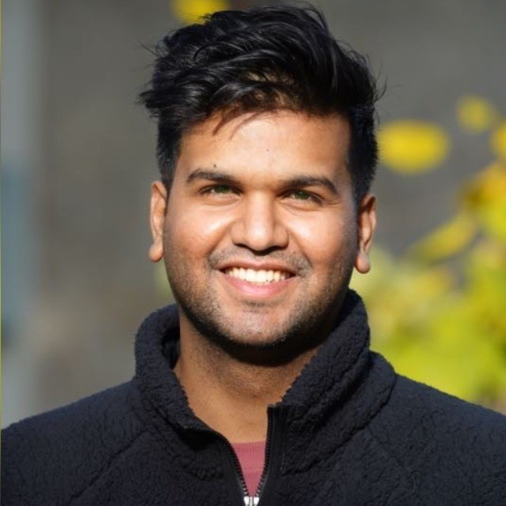

---
# Feel free to add content and custom Front Matter to this file.
# To modify the layout, see https://jekyllrb.com/docs/themes/#overriding-theme-defaults

layout: page
---

  

<!--   

    

  
  -->

<!---
Update: I'm on the job market! I'm happy to explore areas other than my expertise :) Please feel free to reach me at nwani@usc.edu!
I'll be starting as a Member of Technical Staff III (Machine Learning Engineer)
-->

I'm Nikhil, a Machine Learning Engineer and Researcher. I'm currently interested in Generative AI (LLMs) and its applications in Natural Language Processing (NLP).

In early August 2022, I joined **[VMware's](https://www.vmware.com/){:target="_blank"}** [Propel Rotational Program](https://web.archive.org/web/20220801000000*/https://careers.vmware.com/university-propel){:target="_blank"}  as a **Machine Learning Engineer II** at their Palo Alto, CA headquarters in the Stanford Research Park to work on Enterpise NLP, LLM problems on private data. My team works on inventing cutting edge transformer based models that generate representation of the **textual** HTTP headers in absence of natural language syntax and semantics, a first of its kind!

Previously, I was a CS graduate student in the [honors program](https://www.cs.usc.edu/academic-programs/masters/cs_ms_honors/){:target="_blank"} at the **[University of Southern California](https://www.usc.edu/){:target="_blank"}** in sunny Los Angeles. My masters was supported by the [USC Dean's scholarship](https://viterbigradadmission.usc.edu/programs/masters/tuition-funding/gradscholarships/){:target="_blank"}. I wanted machines to not just ***learn***, but also ***understand*** complex ideas the way we do, especially with ***natural languages***. My [master's thesis](https://digitallibrary.usc.edu/Share/0exj4km4sfa4w4irr28102v4d27u51e4){:target="_blank"} proposed new methods in lexical complexity-driven representation learning. My work achieves state-of-the-art on three NLP-ML shared tasks (NAACL 2018): 1. Complex phrase detection, 2. Complex word detection and 3. Grammatical sentence correctness detection, encapsulated for the eventual goal of Lexical Simplification of English text. I was also a TA for USC's popular course [CSCI 570: Analysis of Algorithms](https://viterbi-web.usc.edu/~adamchik/570/syllabus.pdf){:target="_blank"} under [Prof. Victor Adamchik](https://viterbi-web.usc.edu/~adamchik/){:target="_blank"}. 
 

Before joining USC, I spent about two wonderful years (2017-19) as a Machine Learning Research Engineer in the [Department of Computer Science](https://www.cse.iitb.ac.in/){:target="_blank"} at **[IIT Bombay, India](https://www.iitb.ac.in/){:target="_blank"}**. I was advised by [Dr. Pushpak Bhattachary](https://www.cse.iitb.ac.in/~pb/){:target="_blank"} at the [Center for Language Technology](http://www.cfilt.iitb.ac.in/){:target="_blank"}. My research broadly focused on Machine Learning and Natural Language Understanding (Sequence and token classification tasks). 

During the summer of 2017, I worked on [Probabilistic Models for Intelligent Text Input Processing](https://www.interact2017.org/downloads/INTERACT_2017_Adjunct_v4_final_24jan.pdf#page=55){:target="_blank"} as a Machine Learning research intern in the Human-Computer Interaction (HCI) group at the IDC School of Design (IDC Dept), IIT Bombay, India, where I was advised by **[Dr. Anirudha Joshi](http://www.idc.iitb.ac.in/~anirudha/){:target="_blank"}**.

In spring 2017, I worked on Multi-Scale, Multi-Channel 3D Convolutional Neural Network models during my 6 months Machine Learning Co-op/internship at **Nvidia, Pune, India**, where I was lucky to be jointly advised by [Dr. CP Mammen](https://in.linkedin.com/in/cp-mammen-7690735){:target="_blank"} and [Dr. Jayashree Kalpathy Crammer](https://connects.catalyst.harvard.edu/Profiles/display/Person/102986){:target="_blank"} **(MGH, Harvard Medical School)**.

I graduated in 2017 from University of Pune (VIT, Pune) with distinction in Bachelor's of Computer Science. During my undergrad, I received the honorable ACM SIGCHI scholarship, which fueled me to pursue and contribute to Human-Computer Interaction/ User Experience research. 

<!-- Before that, I earned an associates's degree in Computer Engineering with distinction from University of Mumbai (PCP, Pune) in 2014. -->

In my spare time, I'm either hitting sixes on the cricket pitch or hobnobbing with interesting folks at social events. <!--I'm always looking for new, interesting people to interact with.--> If there is anything I can help you with, please feel free to reach out to me at [nikhylwani@gmail.com](mailto:nikhylwani@gmail.com), or message me on [LinkedIn](https://www.linkedin.com/in/nikhilwani){:target="_blank"}! 

For an outline of my recent NLP implementation demos, explore the [Projects](/projects/) section.

<!--- <small><em>*This page may or may not have been produced by a generative AI! :)</em></small> -->

---
---
<!---
&nbsp;

 <b> Try out my new chatbot, DialogGPT! </b> 
  
&nbsp;

*Note: Inference is currently running on **a free-tire shared CPU instance**, so processing time will vary based on availablity. GPU upgrades will be available soon! :)*

<gradio-app src="https://nikhilwani-dialog-gpt.hf.space"></gradio-app>

For more of my NLP quick demos, checkout my [Projects](/projects/) section. 
-->

