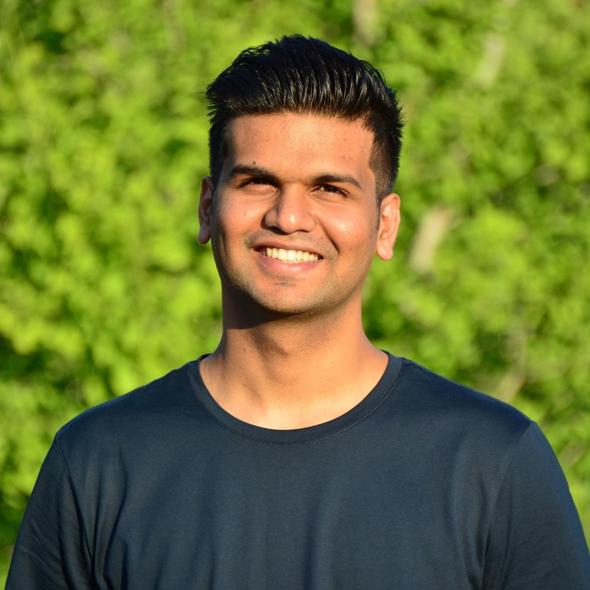
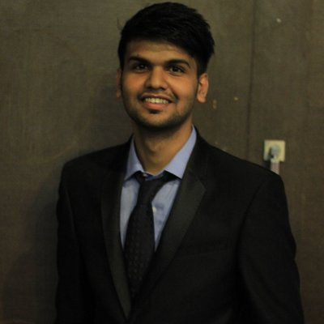

---
# Feel free to add content and custom Front Matter to this file.
# To modify the layout, see https://jekyllrb.com/docs/themes/#overriding-theme-defaults

layout: page
---

  

  

    

  
 

Thank you for stopping by. I am a second-year CS graduate student in the honors program at the [University of Southern California](https://www.usc.edu/) in sunny Los Angeles. 

Before this, I spent two wonderful years as a Machine Learning Research Engineer in the [Department of Computer Science and Engineering](https://www.cse.iitb.ac.in/) at [IIT Bombay, India](https://www.iitb.ac.in/). I was advised by **[Dr. Pushpak Bhattachary](https://www.cse.iitb.ac.in/~pb/)** at the [Center for Language Technology](http://www.cfilt.iitb.ac.in/). My research broadly focuses on Machine Learning and Natural Language Understanding. I am also a ACM SIGCHI Scholar and have experience in Human Computer Interaction/ User Experience research.

 I want machines to not just ***learn***, but also ***understand*** complex ideas the way we do, especially with ***natural languages***. Last summer, I built a state-of-the-art [Contextually Complex Phrase detection]() system. 

During the summer of 2017, I worked on [Probabilistic Models for Intelligent Text Input Processing]() as a research intern in the Human-Computer Interaction (HCI) group at the IDC School of Design (IDC Dept), IIT Bombay, India, where I was advised by **[Dr. Anirudha Joshi](http://www.idc.iitb.ac.in/~anirudha/){:target="_blank"}**.

In spring 2017, I worked on [Multi-Scale 3D Convolutional Neural Network models]() during my internship at **Nvidia, Pune, India**, where I was lucky to be jointly advised by [Dr. CP Mammen](https://in.linkedin.com/in/cp-mammen-7690735) and [Dr. Jayashree Kalpathy Crammer](https://connects.catalyst.harvard.edu/Profiles/display/Person/102986) (MGH, Harvard Medical School).

I graduated in 2017 from VIT, Pune with distinction in Bachelors of Information Technology. Before that, I earned a Diploma in Computer Science Engineering with distinction from PCP, Pune in 2014.

In my spare time, I have begun contributing to [StackOverflow](https://stackoverflow.com/users/9370096/nikhil-wani.){:target="_blank"} and writing [articles](). Outside of research, I like to play Cricket and participate in social events. I'm always looking for new, interesting people to interact with.

You can find my research delineated [here](http://localhost:4000/research/), or peruse a detailed [CV](http://localhost:4000/research/).

