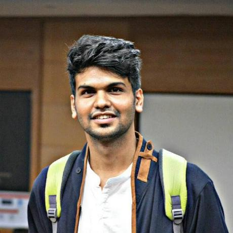

---
# Feel free to add content and custom Front Matter to this file.
# To modify the layout, see https://jekyllrb.com/docs/themes/#overriding-theme-defaults

layout: page
---

  

  

    
<!--     
text
 -->

  
 

<!-- This is a comment -->

<!-- {:style="float:left;margin-top: 6px; margin-right: 7px; margin-bottom: 7px;  height: 200px; border: 5px; border-radius: 5px "} -->

Thank you for stopping by. I am a Research Engineer in the [Department of Computer Science and Engineering](https://www.cse.iitb.ac.in/) at [IIT Bombay, India](https://www.iitb.ac.in/). I am advised by **[Dr. Pushpak Bhattachary](https://www.cse.iitb.ac.in/~pb/)**, and I am fortunate to be working closely with him at the [Center for Indian Language Technology](http://www.cfilt.iitb.ac.in/). My research broadly focuses on natural language understanding and machine learning.

<!-- I am broadly interested in natural language understanding and machine learning.

My research broadly focuses on natural language understanding and machine learning. -->

<!-- A lot of my project target a social theme. 

I identify myself with the NLP(), HCI and ML Community.

I'm interest in Machine Learning, and have been gravitated towards Deep Semantics. Some of projects inlclude: -->

<!-- I am currently a Research Fellow in the Natural Language Processing group at the **[CFILT](http://www.cfilt.iitb.ac.in/) Lab, CSE Dept, IIT Bombay, India** under the aus­pices of [**Dr. Pusphpak Bhattacharya**](https://www.cse.iitb.ac.in/~pb/){:target="_blank"}, who spearheads NLP-AI research in India. Some of my early/intial contributions to the NLP community include: State-of-the-art Contextualy Complex Word Identification(CWI) system, Neural NER system. I'm currenlty investigating I'm currenlty investigating I'm currenlty investigating I'm currenlty investigating I'm currenlty investigating **Deep Semantics** -->

<!-- I am a Research Fellow in the AI-Natural Lanuage Processing group of the CFILT Lab in the CSE Dept at IIT Bombay.
 -->

<!--  I like spending most of my time experimenting with code and life.  -->
 I want machines to not just ***learn***, but also ***understand*** complex ideas the way we do, especially with ***natural langauges***. Last summer, I build a state-of-the-art [Contextually Complex Phrase detection]() system. 

  <!-- Some of my inital contributions to the NLP community include: State-of-the-art [Contextually Complex Word Identification System]() and [Neural Machine Translation System](). I've also worked on primary Natural Language Understanding tasks such as [Neural Machine Comprehension]() for Question Answering and [Supervised Sentiment Analysis]().
 -->

<!-- During the Summer of 2017, I interned at the **Industrail Design Center(IDC Dept), IIT Bombay**, and I was advised by [**Dr. Anirudha Joshi**](http://www.idc.iitb.ac.in/~anirudha/){:target="_blank"}, who leads HCI and Text Input research in India. I worked on my Thesis project: [Probabilistic Models for Intelligent Text Input Processing](). [Probabilistic Generative Models](), [Decoders]() and [Language Models for Intelligent Text Input]() Subsequently, having being selected to attend ACM [SIGCHI Summer School](https://indiahci.org/sigchischool/researchmethods2018/){:target="_blank"} on Research Methods this year (Summer 2018), I've had the chance to further explore Neural Language Modeling for Text Input Prediction. You can learn more about it [here]().  -->

<!-- For two years I spent  -->

<!-- I spent two years understanding  -->

<!-- I worked in the emerging field of Computational Interaction (Deep Learning + HCI) which can be found here - IFIP INTERACT 2017 PAPER, specifically Probabilistic Modeling for touch accuracy and Probabilistic Neural Decoding for Intelligent Text Entry. --> 
During the summer of 2017, I worked on [Probabilistic Models for Intelligent Text Input Processing]() as a research intern in the HCI group at Industrail Design Center (IDC Dept), IIT Bombay, India, where I was advised by **[Dr. Anirudha Joshi](http://www.idc.iitb.ac.in/~anirudha/){:target="_blank"}**.

In spring 2017, I worked on [Multi-Scale 3D Convolutional Neural Network models]() during my internship at **Nvidia, Pune, India**, where I was lucky to be jointly adviced by [Dr. CP Mammen](https://in.linkedin.com/in/cp-mammen-7690735) and [Dr. Jayashree Kalpathy Crammer](https://connects.catalyst.harvard.edu/Profiles/display/Person/102986) (MGH, Harvard Medical School).

<!-- In my spare time, I contribute to [StackOverflow](https://stackoverflow.com/users/9370096/nikhil-wani){:target="_blank"},  play Holdem Poker and enjoy reinforcing my [Poker Maths](http://www.thepokerbank.com/strategy/mathematics/) skills. I used to play Cricket(okay, I still play) and exercising. -->

I graduated in 2017 from VIT, Pune with distinction in Bachelors of Information Technology. Before that, I completed a Diploma with distinction in Computer Science from PCP, Pune in 2014.

<!-- In my spare time, I contribute to [StackOverflow](https://stackoverflow.com/users/9370096/nikhil-wani){:target="_blank"}, play with Latex Macros, reinforce my [Poker Math](http://www.thepokerbank.com/strategy/mathematics/){:target="_blank"} skills by enjoying Holdem Poker. Outside of research, I used to play Cricket(okay, I still play) and exercising. Lately, I've also started enjoying Writing.

 -->

In my spare time, I contribute to [StackOverflow](https://stackoverflow.com/users/9370096/nikhil-wani){:target="_blank"}, and write [articles](). Outside of research, I like to play Cricket and participate in social events. I'm always looking for new, interesting people to interact with. <!-- Lately, I've also started enjoying Writing. -->

You can find my research delineated [here](http://localhost:4000/research/), or peruse a detailed [CV](http://localhost:4000/research/).

